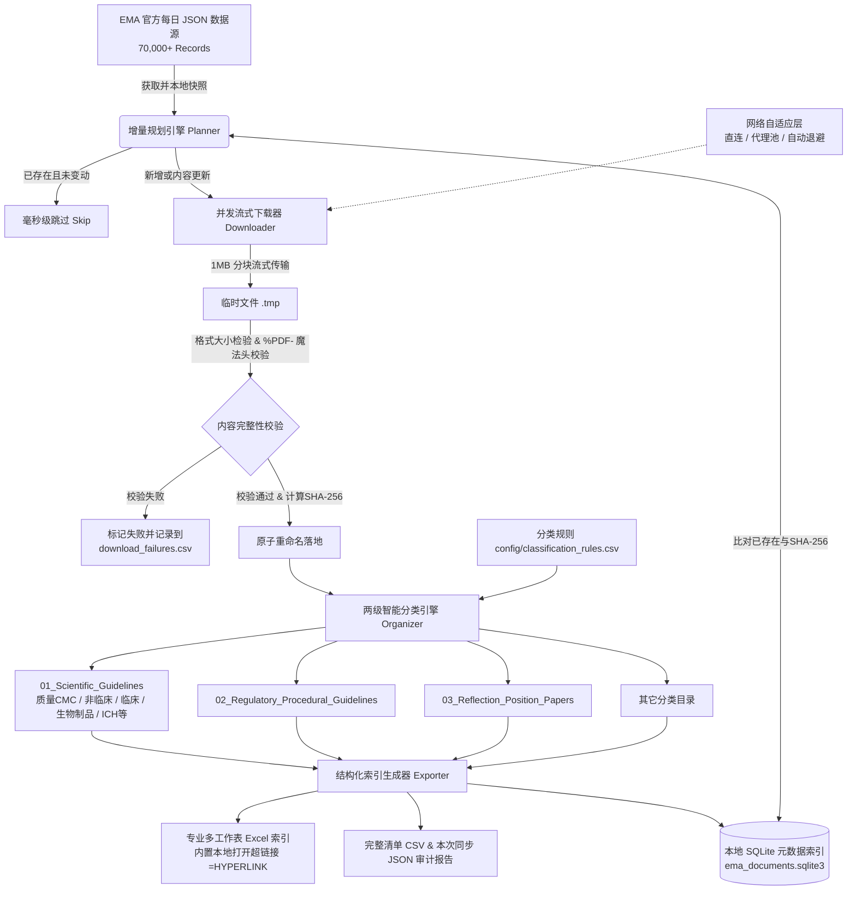

# EMA Regulatory Document Downloader & Organizer

### 欧洲药品管理局（EMA）监管文件与科学指导原则自动化同步整理工具

[](LICENSE)
[](https://github.com/Fiveo9/EMADownloader/actions/workflows/ci.yml)
[](https://www.python.org/)
[](https://github.com/astral-sh/ruff)

面向**注册法规（RA）**、**药政申报**、**医学研发**与**制药合规团队**的企业级开源工具。直接基于 EMA 官方定时发布的机器可读结构化 JSON 数据源，实现科学指导原则与监管程序性文件的**智能增量同步**、**流式断点下载**、**SHA-256 完整性防篡改校验**、**两级自动化分类归档**，以及自动生成**带本地一键直达超链接的专业级 Excel / SQLite 索引库**。

---

## 🖱️ 一键启动（电脑小白版）

不会装 Python？两条路任选：

**方式一：免安装绿色版（推荐，无需任何环境）**

1. 到 [GitHub Releases](https://github.com/Fiveo9/EMADownloader/releases) 下载 `EMA文件库-Windows-x64.zip`
2. 解压到任意文件夹（如桌面）
3. 双击 `EMA文件库.exe` → 浏览器自动打开管理界面

> 黑色控制台窗口是程序本体，使用期间请勿关闭（关掉即退出）；资料库默认生成在 exe 旁边的 `EMA_Regulatory_Library` 文件夹。exe 由官方 CI（Windows x64）自动构建。

**方式二：已装 Python 的用户**

双击仓库根目录的 **`启动Web界面.bat`** 即可：首次运行会自动安装依赖，之后每次双击直达界面。

**自建 exe（可选）**：在本机运行 `build_exe.bat`，产物输出到 `dist\EMA文件库\`。

---

## 🌟 为什么选择 EMA Downloader？

在制药与生命科学领域，跟踪并整理欧洲药品管理局（EMA）的海量法规（70,000+ 份文件）传统上依赖人工下载或易失效的浏览器模拟爬虫。**EMA Downloader** 提供了一套可靠、工程级合规的解决方案：

| 维度 | 传统爬虫方案 (如 Selenium/Playwright) | 人工维护方式 | EMA Downloader |
| :--- | :--- | :--- | :--- |
| **数据源** | 动态 DOM 解析，改版即崩溃 | 网站手动搜索下载 | **官方结构化 JSON API**（每日定时更新） |
| **稳定性** | 易被 WAF 拦截或超时假死 | 极易遗漏版本更新 | **原生 HTTP 流式下载 + 自动重试退避** |
| **增量同步** | 全量扫描，重复下载浪费带宽 | 手工比对极度耗时 | **毫秒级增量识别**（基于 ID、更新时间与哈希） |
| **归档体系** | 杂乱扁平存放 | 命名随意，缺乏统一标准 | **两级专业分类**（文档类型 + CMC/临床/非临床科学领域） |
| **检索索引** | 无索引或简陋文本清单 | 手工录入 Excel 表格 | **自动生成多 Sheet 格式化 Excel（含本地超链接）+ SQLite** |
| **网络自适应** | 频繁触发 429 速率限制 | 受限于单机网络 | **支持直连/代理池轮换/自动频控调节** |

---

## 🏗️ 架构与数据流



---

## 📁 自动化资料库目录结构

下载与整理完成后，资料库将呈现清晰规范的两级分类层级：

```text
EMA_Regulatory_Library/
├── 00_Index/                                   # 索引与审计中心
│   ├── ema_documents.sqlite3                   # 本地元数据 SQLite 数据库
│   ├── EMA_Document_Index.xlsx                 # 多工作表格式化 Excel 索引（内置本地打开超链接）
│   ├── EMA_Document_Index.csv                  # 扁平化完整元数据 CSV 清单
│   └── sync_report_YYYYMMDD_HHMMSS.json        # 历次同步统计与审计报告
├── 01_Scientific_Guidelines/                   # 第一级：科学指导原则
│   ├── 01_Quality/                             # 第二级：质量与 CMC（稳定性、杂质、分析方法等）
│   ├── 02_Nonclinical/                         # 第二级：非临床药理毒理（安全药理、遗传毒性等）
│   ├── 03_Clinical_Efficacy_Safety/            # 第二级：临床有效性与安全性（临床试验、终点等）
│   ├── 04_Biologicals/                         # 第二级：生物制品、疫苗、基因与细胞治疗
│   ├── 05_Multidisciplinary/                   # 第二级：多学科（生物类似药、儿科人群等）
│   ├── 06_ICH/                                 # 第二级：ICH 协调指导原则（Q/S/E/M）
│   ├── 07_Herbal_Medicines/                    # 第二级：传统草药制品
│   └── 99_Uncategorized/                       # 未命中的科学指南归档
├── 02_Regulatory_Procedural_Guidelines/        # 第一级：监管与审评程序性指导原则
├── 03_Reflection_Position_Concept_Papers/      # 第一级：反思报告、立场文件与概念文件
├── 04_QA_Public_Statements/                    # 第一级：问答（Q&A）与公开声明
├── 05_EU_Legislation_Optional/                 # 第一级：欧盟法规相关文件
├── 90_Raw_JSON/                                # 官方原始数据每日快照备份
│   └── documents-output-json-report_en_YYYYMMDD.json
└── 99_Failed_Downloads/                        # 异常与失败追踪
    ├── download_failures.csv                   # 失败文档及官方 HTTP 错误诊断
    └── download_manifest.csv                   # 本地全量文件的 SHA-256 指纹清单
```

---

## 🚀 快速上手

### 1. 环境准备

- **Python 3.10** 或更高版本（完整支持 Python 3.10 / 3.11 / 3.12 / 3.13 / 3.14）
- 操作系统支持：Windows、macOS、Linux

### 2. 安装

```bash
# 克隆代码仓库
git clone https://github.com/Fiveo9/EMADownloader.git
cd "EMA Downloader"

# 安装生产依赖并注册命令行工具
pip install -e .

# 如需开发测试，可安装开发套件
pip install -e ".[dev]"

# 如需通过 SOCKS5 代理下载
pip install -e ".[socks]"

# 如需使用本地 Web 图形界面
pip install -e ".[ui]"
```

---

## 💻 命令行使用指南

安装完成后，可直接使用 `ema-downloader` 命令行工具（或通过 `python -m ema_downloader` 运行）。

### 1. 预览同步（Dry-run 试运行）
只拉取最新官方元数据并分析本地差异，**不下载任何实际文件**，用于评估新增数量：
```bash
ema-downloader sync --dry-run
```

### 2. 小批量测试同步
首次运行时，建议限制数量先行体验：
```bash
ema-downloader sync --limit 20
```

### 3. 全量生产级同步
同步所有科学指导原则和监管程序性文件（支持断点续传，再次运行毫秒级跳过）：
```bash
ema-downloader sync --types scientific-guideline regulatory-procedural-guideline --workers 5
```

### 4. 灵活条件筛选同步

- **按指导原则状态筛选**（仅已正式采纳的文件，排除废止草案）：
  ```bash
  ema-downloader sync --status Adopted
  ```

- **增量同步近期更新**（指定更新日期之后）：
  ```bash
  ema-downloader sync --updated-since 2025-01-01
  ```

- **关键词精准检索**（如只下载肿瘤学相关）：
  ```bash
  ema-downloader sync --keyword oncology
  ```

- **使用代理服务器**（支持 HTTP/HTTPS/SOCKS5 代理或代理池；SOCKS5 需先安装 `pip install -e ".[socks]"`）：
  ```bash
  ema-downloader sync --proxy "http://127.0.0.1:7890" --workers 5
  ```

### 5. 其它实用子命令

| 命令 | 说明 | 适用场景 |
| :--- | :--- | :--- |
| `ema-downloader metadata` | 仅更新本地数据库与元数据索引，不下载 PDF | 快速获取最新法规目录 |
| `ema-downloader download` | 单独针对未下载或失败项执行下载 | 网络波动后断点续传重试 |
| `ema-downloader organize` | 重新扫描本地库并按最新规则归档分类 | 修改了分类规则 CSV 时快速重组目录 |
| `ema-downloader export` | 重新生成多工作表 Excel、CSV 索引 | 库文件变更后单独刷新索引 |
| `ema-downloader verify` | 全盘扫描已下载 PDF 的文件头、大小及 SHA-256 | 本地资料库完整性定期审计 |

---

## 🖥️ 本地 Web 界面

不喜欢敲命令行？安装 UI 扩展后，一条命令即可在浏览器中管理整个资料库：

```bash
pip install -e ".[ui]"
ema-downloader-ui            # 启动后自动打开浏览器（默认 http://127.0.0.1:5000）
```

也可以通过模块方式运行，或自定义端口 / 配置：

```bash
python -m ema_downloader.webapp --port 8000
ema-downloader-ui --config path/to/settings.toml --no-browser
```

> 安全说明：服务仅绑定本机回环地址 `127.0.0.1`，局域网内其他设备无法访问。

### 界面功能

| 标签页 | 功能 |
| :--- | :--- |
| **总览** | 文档总数 / 各类型 / 下载状态统计卡片，上次同步结果摘要，一键启动同步、整理、导出、校验任务 |
| **文档库** | 按关键词、类型、下载状态检索全部文档，分页浏览，一键打开本地 PDF / 所在文件夹 / EMA 官网链接 |
| **任务** | 实时进度条（阶段 + 已完成数 + 当前文件）、后台日志滚动输出、任务取消、历史任务记录 |
| **设置** | 图形化管理并发数、超时、重试、代理、默认筛选类型 / 状态 / 语言、资料库目录与分类规则路径 |

「开始同步」支持在对话框中按次覆盖参数：文档类型、官方状态、关键词、更新起始日期、限制数量、并发数、代理，并可勾选 **Dry-run 预览模式**。

「设置」页可图形化管理并发数、超时重试、代理、默认筛选、资料库目录与分类规则路径。修改只写入个人覆盖文件 `config/settings.local.toml`（已 gitignore，代理凭据不会泄露到 git；已有内容与注释原样保留），保存后立即生效，无需重启；代理仅显示掩码，保持不变则不修改，留空保存即清除。

### 与命令行的关系

Web 界面与 CLI 完全共享同一套核心引擎与本地资料库（SQLite 索引、分类规则、导出文件），两种方式可混用：界面启动的同步任务同样写入 `sync_history` 并生成 `sync_report_*.json` 审计报告。为保证数据一致性，同一时刻只允许运行一个长任务，运行中再次提交会被拒绝。

---

## 📊 格式化 Excel 索引亮点

导出的 `EMA_Document_Index.xlsx` 包含 **6 个专业工作表**，每个工作表均带有定制化排版与公式：

1. **All Documents**：收录所有文件的完整档案；
2. **Scientific Guidelines**：按科学领域分类展示技术指南；
3. **Regulatory Procedural**：集中展示申报流程与审评规程；
4. **Draft and Consultation**：展示征求意见草案，方便把握监管动向；
5. **Failed Downloads**：追踪死链、403、404 等异常，附带官方 URL 便于排查；
6. **Sync Summary**：本次同步各状态统计摘要。

> 💡 **本地一键直达**：表格最后一列包含 `=HYPERLINK("../01_Scientific_Guidelines/...pdf", "打开文件")`。点击即可在电脑上直接打开对应的本地 PDF，无需繁琐翻找目录！

---

## ⚙️ 配置说明

### 主配置文件 `config/settings.toml`

```toml
[sources]
documents_url = "https://www.ema.europa.eu/en/documents/report/documents-output-json-report_en.json"

[storage]
library_dir = "EMA_Regulatory_Library"

[network]
# 识别请求标识
user_agent = "EMADownloader/0.1.0 (+https://github.com/Fiveo9/EMADownloader)"
timeout = 45.0
max_retries = 3
retry_delay = 2.0
workers = 5                       # 并发下载线程数
proxy = ""                        # 代理地址（支持留空自动探测、环境变量或代理池）
request_delay = 0.5               # 每次下载成功后的保护延迟（秒），避免单IP触发429频控

[filters]
default_types = [
    "scientific-guideline",
    "regulatory-procedural-guideline"
]
default_status = []
default_languages = ["en"]
```

### 个人配置覆盖 `config/settings.local.toml`

`settings.toml` 是随仓库提交的默认模板。如需写入私有信息（例如带账号密码的代理池），请将其放入 `config/settings.local.toml`——该文件已被 `.gitignore` 忽略、永远不会提交，程序启动时会自动将其逐节覆盖到 `settings.toml` 之上。

### 代理与防限速策略

- **无代理直连**：建议将 `workers = 1`，`request_delay = 1.5`，温和请求官方服务器以避免 `HTTP 429 Too Many Requests`；
- **使用动态代理池 / 本地代理**：可安全开启 `workers = 4 ~ 5`，`request_delay = 0.5`，全量 3,500+ 份文件约 **15~20 分钟** 即可全部完成。

---

## 🏷️ 分类规则定制 `config/classification_rules.csv`

用户可自由定制科学指导原则的第二层子领域规则。系统支持按优先级多字段（参考号、URL路径、标题关键词）精准识别：

```csv
Priority,Field,Keywords,Folder
10,Quality,"quality;manufacture;stability;impurity;active substance;specification",01_Quality
20,Nonclinical,"non-clinical;toxicology;pharmacology;safety pharmacology",02_Nonclinical
30,Clinical,"clinical;efficacy;safety;trial;endpoint;pharmacovigilance",03_Clinical_Efficacy_Safety
40,Biologicals,"biological;vaccine;cell therapy;gene therapy;atmp;plasma",04_Biologicals
50,Multidisciplinary,"multidisciplinary;biosimilar;paediatric;combination",05_Multidisciplinary
60,ICH,"ICH;q1;q2;q3;q4;s1;s2;s3;e1;e2;e3;e6;m1;m4",06_ICH
70,Herbal,"herbal;HMPC;traditional herbal;plant",07_Herbal_Medicines
```

---

## 🧪 自动化测试

项目内置了完备的自动化测试套件（覆盖数据规范化、分类引擎、数据库事务、下载器、Excel 生成与 CLI 流程）：

```bash
# 运行单元测试
pytest

# 运行详细测试并输出覆盖率
pytest -v --cov=ema_downloader
```

---

## 🤝 参与贡献

欢迎提交 Issue 和 Pull Request！
- 贡献代码前请确保运行 `ruff check` 与 `pytest`；
- 欢迎为 `config/classification_rules.csv` 补充更细致的药学分类规则；
- 欢迎反馈 EMA 官方数据源字段变更。

---

## ⚖️ 免责声明（Disclaimer）

1. 本项目为独立的开源研究与合规工具，**并非**欧洲药品管理局（EMA）官方项目，亦未获得 EMA 的官方背书或关联。
2. 本工具下载的所有文档版权均归属于欧洲药品管理局（EMA）或相应的欧盟监管机构。使用本工具时，请遵守 [EMA 官方网站的使用条款](https://www.ema.europa.eu/en/about-us/about-website/legal-notice)。
3. 请合理配置并发线程数与请求延迟，文明请求官方公共数据基础设施。

---

## 📄 许可证

本项目基于 [MIT 许可证](LICENSE) 开源。
